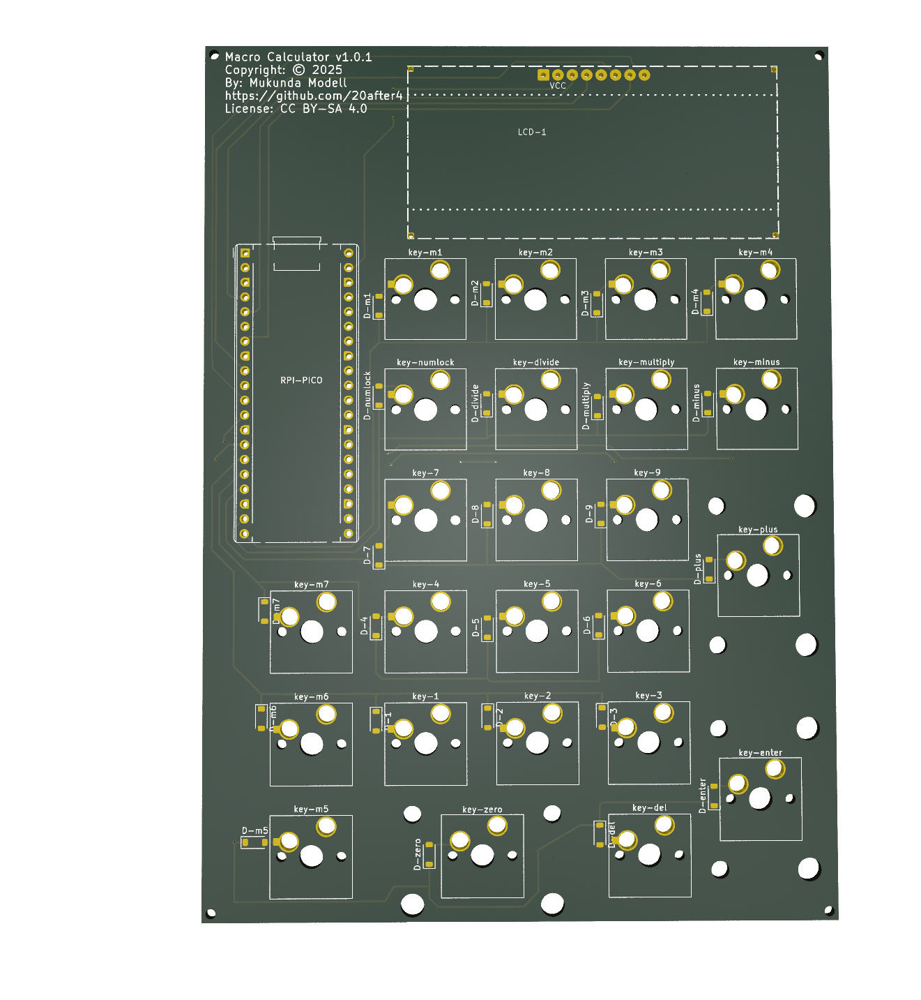
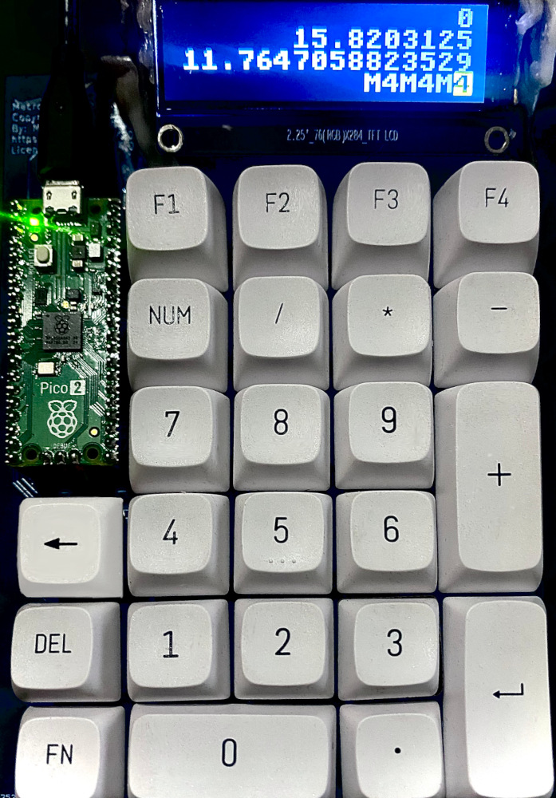

# MacroCalculator

Custom Mechanical USB Keypad + Standalone Calculator written in MicroPython

## Hardware:

 

* Custom 24 Key Matrix PCB
    * Supports hot-swapable MX-style key switches
    * Hand solderable (Difficulty: medium-high due to small surface mount diodes)
    * Standard PC Numpad Keys
    * 7 extra macro keys
    * Sockets for MCU and LCD via pin headers.
* RPi Pico 2 (RP2350 MCU)
* 72x284 resolution ST7789 LCD Screen: 16px font = 4 lines x 17 characters

## Software / Firmware

Custom Python App running on [lvgl/lv_micropython](https://github.com/lvgl/lv_micropython) firmware.

The NumLock key toggles between two modes:

* Calc mode:
  * Basic calculator functionality
  * 17 digits of decimal precision
  * Basic expression evaluation
  * Named variables assignable to the macro keys
  * Scrollable history buffer
* Keypad mode:
  * Basic USB HID Numpad
  * Macro keys programmable with MicroPython for nearly unlimited flexibility.
