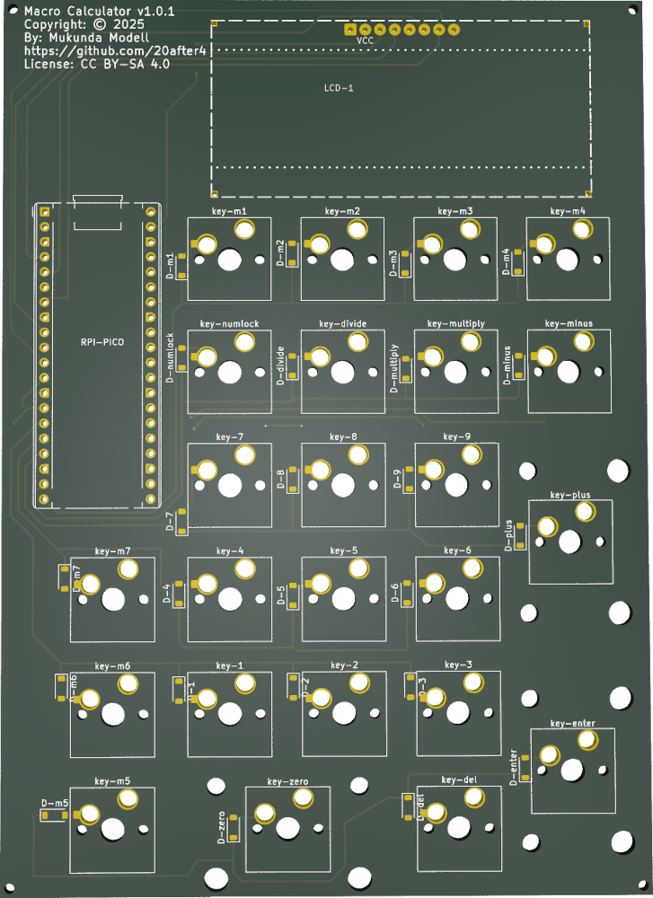

# MacroCalculator

Custom Mechanical USB Keypad + Standalone Calculator written in MicroPython

## Hardware:

 

* Custom 24 Key Matrix PCB
    * Supports hot-swapable MX-style key switches
    * Hand solderable (Difficulty: medium-high due to small surface mount diodes)
    * Standard PC Numpad Keys
    * 7 extra macro keys
    * Sockets for MCU and LCD via pin headers.
* RPi Pico 2 (RP2350 MCU)
* 72x284 resolution ST7789 LCD Screen: 16px font = 4 lines x 17 characters

## Software / Firmware

Custom Python App running on [lvgl/lv_micropython](https://github.com/lvgl/lv_micropython) firmware.

The NumLock key toggles between two modes:

* Calc mode:
  * Basic calculator functionality
  * 17 digits of decimal precision
  * Basic expression evaluation
  * Named variables assignable to the macro keys
  * Scrollable history buffer
* Keypad mode:
  * Basic USB HID Numpad
  * Macro keys programmable with MicroPython for nearly unlimited flexibility.

### Acknoledgements

Here I credit the projects that made this one possible. This project draws on these other open source projects for inspiration and some of the components used in developing macro-calc:

* Raspberry Pi Pico - The RP2040 and successors have proven to be a very affordable and accessible microcontroller development platform which has significantly lowered the barrier to entry for embedded development.
* [MicroPython](https://www.micropython.org/): The programming language runtime and embedded firmware infrastructure.
* [LVGL](https://lvgl.io/) - Graphics API for embedded devices which I've utilized in order to support the LCD display in this project.
* [lvgl/lv_micropython](https://github.com/lvgl/lv_micropython) is a fork of micropython designed for building microcontroller Firmware with integrated LVGL graphics capabilities compiled into the micropython runtime. This is the foundation I've used to build the firmware for this project.
* [lvgl_micropython](https://github.com/lvgl-micropython/lvgl_micropython) deserves an honorable mention. This is an alternative fork, based on the previously mentioned project.  Although I don't currently use this fork to build my firmware, I have learned quite a lot about TFT Display chips from studying their source code, issues and discussions on github and on the lvgl forums.
* [mpy-dev/micropython-decimal-number](https://github.com/mpy-dev/micropython-decimal-number) provides
  a basis for sane decimal arithmatic. This has proven very helpful for the calculator portion of this project. Floating point math isn't a good fit for a general purpose calculator.
